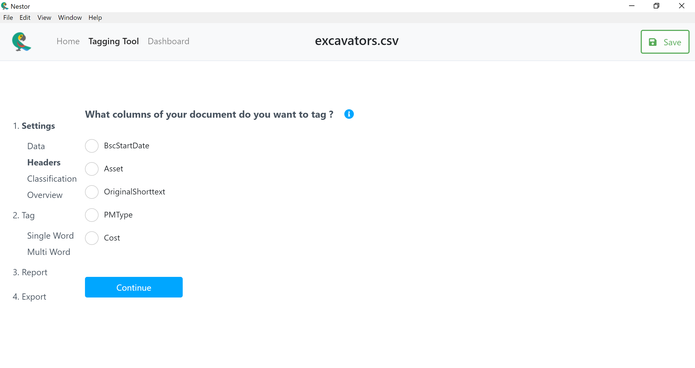
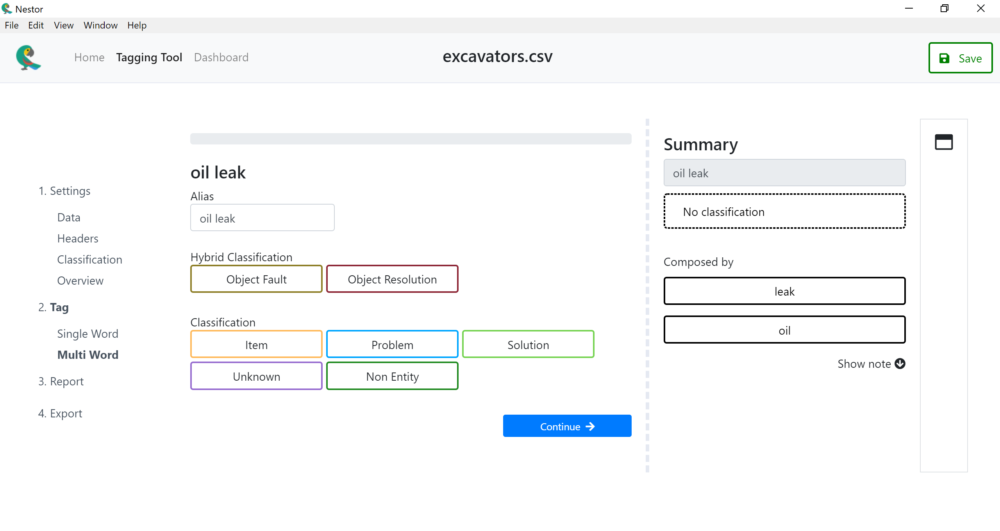

# Nestor technical specifications

## Table of Contents


[Introduction](#introduction)
> [Purpose](#purpose)<br/>
> [Team](#team)<br/>
> [Project scope](#project-scope)<br/>
> [References](#references)

[Description](#description)

[Features](#features)

[Phases](#phases)

[General architecture](#general-architecture)

[Operating environment](#operating-environment)

[Content structure](#content-structure)

[Design](#design)

[Software User Interface](#software-user-interface)

[Assumptions / Dependencies](#assumptions-dependencies)

[System features](#system-features)

[React application](#react-application)

[Python APIs description](#python-apis-description)

[classification](#classification)

[upload ](#upload)

[headers ](#headers)

[create-output ](#create-output)

[single-tokens ](#single-tokens)

[multi-tokens ](#multi-tokens)

[update-output-file](#section-9)

[update-vocab](#update-vocab)

[update-data](#update-data)

[completeness](#completeness)

[export](#export)

[ADDITIONAL NONFUNCTIONAL REQUIREMENTS](#additional-nonfunctional-requirements)

[ACCESSIBILITY](#accessibility)

[SECURITY](#security)

[PERFORMANCE](#performance)

[SOFTWARE QUALITY](#software-quality)

[APPENDICES](#appendices)

[APPENDIX A: ANALYSIS DOCUMENTATION](#appendix-a-analysis-documentation)

[APPENDIX B: ISSUES](#appendix-b-issues)

# INTRODUCTION

## PURPOSE

This application was designed to help manufacturers "tag" their
maintenance work-order data according to the methods being researched by
the Knowledge Extraction and Applications project at the NIST
Engineering Laboratory. The goal of this application is to give
understanding to data sets that previously were too unstructured or
filled with jargon to analyze.

This application is an overhaul of the previous native application that
contained :

• Tagging Tool: Human-in-the-loop Annotation Interface (pyqt)

• Unstructured data processing toolkit (sklearn-style)

• Vizualization tools for tagged MWOs-style data (under development)

The new application is an electron application that encloses :

• Tagging Tool: Human-in-the-loop Annotation Interface (react
application)

• Unstructured data processing toolkit (sklearn-style) (python package)

## TEAM

This toolkit is a part of the Knowledge Extraction and Application for
Smart Manufacturing (KEA) project, within the Systems Integration
Division at NIST.

**Points of Contact**

• Michael Brundage Principal Investigator

• Thurston Sexton Nestor Technical Lead

**Contributors**

• Michael Brundage: Principal Investigator

• Thurston Sexton: Nestor Technical Lead

• Sakina Laanani: Nestor developer (2018-2019)

• Cedric Bell: Nestor developer (2019-2020)

## PROJECT SCOPE

The KEA project seeks to better frame data collection and transformation
systems within smart manufacturing as collaborations between human
experts and the machines they partner with, to more efficiently utilize
the digital and human resources available to manufacturers. Kea (nestor
notabilis) on the other hand, are the world's only alpine parrots,
finding their home on the southern Island of NZ. Known for their
intelligence and ability to solve puzzles through the use of tools, they
will often work together to reach their goals, which is especially
important in their harsh, mountainous habitat.

## REFERENCES

Previous Nestor documentation
<https://buildmedia.readthedocs.org/media/pdf/nestor/latest/nestor.pdf>

# DESCRIPTION

This electron application will be a substitute to the initial native
application. It will not require any prior installation from the user
and will be accessible via an executable file for windows machines.

Nestor-web features are therefore identical to the previous nestor
application.

# FEATURES

List of Nestor-web main features.

Settings

Upload a file

Extract user selected data

Set the similarity

Get an overview of all settings

Tagging

Extract 'tf-idf' ranked tokens

Get 'fuzzy wuzzy' synonyms for each token

Tag the tokens

Report

Get information on tagged tokens

Export

Export to a csv file the progress in the form of two vocabulary files,
and 'readable tags' file.

Create, save, open and delete projects from imported csv file

# PHASES
------

1 : Design Marvel App

2 : Create React Application

3 : Find Back End

4 : Integrate Front end and Back end with Electron

5 : cycle of development : integration of new features 

# TECHNICAL DIAGRAM or GENERAL ARCHITECTURE


# OPERATING ENVIRONMENT


The application has 3 versions : windows, linux, mac. The application is
stand alone and doesn't any installation, it will function on any
machine (as long as it has been packaged for the machine's
architecture). Currently, due to zerorpc issues, each packaged
application has to be packaged on the targeted platform.

# CONTENT STRUCTURE

The main components interacting together in this application are :

-   Electron main process

-   React source files

-   Python Server

-   Python Package

# DESIGN

Nestor web views were designed using Marvel, an application to create a
prototype of digital products with wireframes.

<https://marvelapp.com/466i27h/screen/48984978>

Screenshots of the application :

       
  ---------------------------------------------------------------------------------------------------------- ---------------------------------------------------------------------------------------------------------
       
       
       
      
     

# SOFTWARE USER INTERFACES 

This section concerns the technical choices of the nestor web
application. For reminder, the application is built with React, python,
electron and zerorpc.

**Why React ?**

React is faster than vanilla javascript because of its use of the
virtual DOM.

React uses jsx components, these reusable components allow the codebase
to become very modular. Finally the framework is highly maintained by a
large community.

The application was bootstrapped with the create-react-app project
because of all the boiler plate code used in it. It contains a
development server, webpack for bundling files, babel for compiling
javascript code and jsx code, the hot module reloading. It is possible
to easily customize configuration for production.

On the server side React is also platform agnostic. Which means we can
use any options to serve our React application.

The application was designed with a server side Nodejs backend written
in javascript communicating with a python server written in python as
well as a javascript front end application.

A system of data persistence has been integrated into the application to
enable users to save their actions done on the application. The database
management is made with the technology pouchDb, built on top of the most
known CouchDB database.

**Why POuchDB ?**

PouchDB is an in-browser database that allows applications to save data
locally, so that users can enjoy all the features of an app even when
they\'re offline. Plus, this database is embeddable in an Electron
requirement which is a must-have requirement for this project due to the
deployment of the project.

Finally, pouchDB is currently used by many developers and has a really
large community to deal with potential troubleshouting. The database
storage is only limited by the client's machine currently, but it can be
set in the source code.

The communication between the python script (where all the data
manipulation is done) and the frontend is made by zerorpc sockets. With
zerorpc technology, we basically create a server for the python script,
which we are going to call from the frontend part when we need the data.

**Why Electron ?**

Electron uses Nodejs and that's the reason why it has faster response
time, fewer server side code, fewer files. Usually, codebases are more
consistent and highly scalable.

Electron is part of a large ecosystem of open-source libraries that make
it great for prototyping.

It allowed us to create an offline application that does not need to be
connected to any server. Electron is the technology that enables us to
package the application and its different parts (react frontend, python
script) and to launch these parts at the launching of the application.

**Why Python ?**

Python is used in the application to use the functions exposed by the
nestor package. It was a natural choice as it's the most convenient to
match python with itself in a coding mindset.

**Why zerorpc ?**

Zerorpc is a technology built on top on zeromq, and is used to ensure
the communication between the react frontend server and the python
server. Basically this technology enables us to open socket between the
two servers.

# ASSUMPTIONS / DEPENDENCIES

Minimum requirements for running an electron application are:

**Windows**

-   Both x86 and amd64 (x64) binaries are provided for Windows

**Mac**

-   Only 64bit binaries are provided for macOS, and the minimum macOS
    > version supported is macOS 10.10.

**Linux**

-   The prebuilt ia32(i686) and x64(amd64) binaries of Electron are
    > built on Ubuntu 12.04, the arm binary is built against ARM v7 with
    > hard-float ABI and NEON for Debian Wheezy.

-   Ubuntu 12.04 and later

```{=html}
<!-- -->
```
-   Fedora 21

-   Debian 8


About RAM and CPU, there are no information about that in Electron\'s
docs, but Electron is based on Chromium, so it should need nearly the
same requirements:

**Windows**

-   An Intel Pentium 4 processor or later that\'s SSE2 capable

-   512 MB of RAM

**Mac**

-   An Intel processor that\'s 64-bit

-   512 MB of RAM

**Linux**

-   An Intel Pentium 4 processor or later that\'s SSE2 capable

<https://electronjs.org/docs/tutorial/support>

# SYSTEM FEATURES

## React application

Client-side routing diagram


Currently, the routes to the pattern, similarity, and tokens number page
are blocked on purpose. The react application file structure is grouped
by routes. Each page is grouped with a css sheet, the actual jsx
component, the store's reducer and the store's action functions.

## Python APIs description

classification

+-----------------+---------------------------------------------------+
| **Code**        |  def classification(self):                        |
|                 |                                                   |
|                 |         return kex.nestorParams                   |
+=================+===================================================+
| **Description** |  Returns the classification list defined in the   |
|                 | nestor python package                             |
+-----------------+---------------------------------------------------+

upload
------

+-----------------+---------------------------------------------------+
| **Code**        | def upload(self, f):                              |
|                 |                                                   |
|                 |         try:                                      |
|                 |                                                   |
|                 |                                                   |
|                 |     s = base64.b64decode(f).decode(\'utf-8-sig\') |
|                 |                                                   |
|                 |             rows = s.split(\'\\n\')               |
|                 |                                                   |
|                 |             del rows\[-1\]                        |
|                 |                                                   |
|                 |             da                                    |
|                 | ta = \[np.array(\[ \'\"{}\"\'.format(x) for x in  |
|                 |                                                   |
|                 | list(csv.reader(\[row\], delimiter=\',            |
|                 | \', quotechar=\'\"\'))\[0\] \]) for row in rows\] |
|                 |                                                   |
|                 |             d                                     |
|                 | = pd.DataFrame(data=data\[1:\],columns=data\[0\]) |
|                 |                                                   |
|                 |             d.columns = \[c.                      |
|                 | replace(\'\"\', \'\') for c in d.columns.values\] |
|                 |                                                   |
|                 |             d.fillna(value=\'\"\', inplace=True)  |
|                 |                                                   |
|                 |             self.\_\_class\_\_.d                  |
|                 | f = d.applymap(lambda x: x.replace(\'\"\', \'\')) |
|                 |                                                   |
|                 |         except Exception as e:                    |
|                 |                                                   |
|                 |             print(e)                              |
|                 |                                                   |
|                 |             sys.stdout.flush()                    |
|                 |                                                   |
|                 |             return e                              |
+=================+===================================================+
| **Description** |  Creates the pandas data frame containing the csv |
|                 | file uploaded by the user                         |
+-----------------+---------------------------------------------------+

uploadJSON
----------

+-----------------+---------------------------------------------------+
| **Code**        | {width="5.812139107611548in" |
|                 | height="4.2256408573928255in"}                    |
|                 |                                                   |
|                 | {width="6.255958005249344in" |
|                 | height="4.3461526684164475in"}                    |
+=================+===================================================+
| **Description** | This function is called when the user opens a     |
|                 | project from the database. It is creating the     |
|                 | pandas data frame containing the same data than   |
|                 | in the csv file uploaded when creating the        |
|                 | project. Then it returns the singleTokens and     |
|                 | multiTokens lists scored by 'tf-idf'.             |
+-----------------+---------------------------------------------------+

headers
-------

+-----------------+---------------------------------------------------+
| **Code**        | def headers(self):                                |
|                 |                                                   |
|                 |         try:                                      |
|                 |                                                   |
|                 |             data = {}                             |
|                 |                                                   |
|                 |             tooltips = \[\]                       |
|                 |                                                   |
|                 |                                                   |
|                 |         length = self.\_\_class\_\_.df.shape\[0\] |
|                 |                                                   |
|                 |                                                   |
|                 | tooltips\_length = 5 if (length\>5) else (length) |
|                 |                                                   |
|                 |             for index in                          |
|                 |  range(len(list(self.\_\_class\_\_.df.columns))): |
|                 |                                                   |
|                 |                 tooltips.append(\[\])             |
|                 |                                                   |
|                 |                 toolt                             |
|                 | ips\[index\] = (list(self.\_\_class\_\_.df\[list( |
|                 |                                                   |
|                 | self.\_\_class\_\_.df.columns)                    |
|                 | \[index\]\].iloc\[np.arange(tooltips\_length)\])) |
|                 |                                                   |
|                 |             data\[\'tooltip\'\] = tooltips        |
|                 |                                                   |
|                 |             self.\_\                              |
|                 | _class\_\_.df.replace(\'\', np.nan, inplace=True) |
|                 |                                                   |
|                 |             filtered\_data = self.\_\_c           |
|                 | lass\_\_.df.dropna(axis=\'columns\', how=\'all\') |
|                 |                                                   |
|                 |             d                                     |
|                 | ata\[\'headers\'\] = list(filtered\_data.columns) |
|                 |                                                   |
|                 |             empty\_c                              |
|                 | olumns = list(set(self.\_\_class\_\_.df.columns). |
|                 |                                                   |
|                 | sy                                                |
|                 | mmetric\_difference(set(filtered\_data.columns))) |
|                 |                                                   |
|                 |                                                   |
|                 |       data\[\'empty\_columns\'\] = empty\_columns |
|                 |                                                   |
|                 |             return json.dumps(data)               |
|                 |                                                   |
|                 |         except Exception as e:                    |
|                 |                                                   |
|                 |             print(e)                              |
|                 |                                                   |
|                 |             sys.stdout.flush()                    |
|                 |                                                   |
|                 |             return e                              |
+=================+===================================================+
| **Description** |  Returns a json containing an array of the        |
|                 | non-empty columns names in the csv, the first 5   |
|                 | values for these columns, and an array of columns |
|                 | names that are empty                              |
+-----------------+---------------------------------------------------+

create-output
-------------

+-----------------+---------------------------------------------------+
| **Code**        | def create\_output(self, headers):                |
|                 |                                                   |
|                 |         try:                                      |
|                 |                                                   |
|                 |             d = pd.DataF                          |
|                 | rame(np.empty((self.\_\_class\_\_.df.shape\[0\],  |
|                 |                                                   |
|                 | len(self.\_\_class                                |
|                 | \_\_.classification\_columns)), dtype = np.str),  |
|                 |                                                   |
|                 | co                                                |
|                 | lumns=self.\_\_class\_\_.classification\_columns) |
|                 |                                                   |
|                 |             self.\_\_class\_\_.output\_df = p     |
|                 | d.concat(\[self.\_\_class\_\_.df\[headers\], d\], |
|                 |                                                   |
|                 |  axis=1, sort=False)                              |
|                 |                                                   |
|                 |         except Exception as e:                    |
|                 |                                                   |
|                 |             print(e)                              |
|                 |                                                   |
|                 |             sys.stdout.flush()                    |
|                 |                                                   |
|                 |             return e                              |
+=================+===================================================+
| **Description** | Creates the readable-tags csv file data frame     |
+-----------------+---------------------------------------------------+

single-tokens
-------------

+-----------------+---------------------------------------------------+
| **Code**        |  def single\_tokens(self, headers):               |
|                 |                                                   |
|                 |         try:                                      |
|                 |                                                   |
|                 |             \#1. Create the output dataframe      |
|                 |                                                   |
|                 |             self.create\_output(headers)          |
|                 |                                                   |
|                 |             \#2. Compute single tokens            |
|                 |                                                   |
|                 |                                                   |
|                 |    nlp\_select = kex.NLPSelect(columns = headers) |
|                 |                                                   |
|                 |             self.\_\_class\_\_.raw\_te            |
|                 | xt = nlp\_select.transform(self.\_\_class\_\_.df) |
|                 |                                                   |
|                 |             tex = kex.TokenExtractor()            |
|                 |                                                   |
|                 |             toks =                                |
|                 |  tex.fit\_transform(self.\_\_class\_\_.raw\_text) |
|                 |                                                   |
|                 |             token                                 |
|                 | s = \[token for token in (tex.vocab\_).tolist()\] |
|                 |                                                   |
|                 |             \#3. Create the vocab dataframe       |
|                 |                                                   |
|                 |                                                   |
|                 |   empty\_array = np.chararray((len(tex.vocab\_))) |
|                 |                                                   |
|                 |             empty\_array\[:\] = \'\'              |
|                 |                                                   |
|                 |             data = np.column                      |
|                 | \_stack((tex.vocab\_,empty\_array, empty\_array,  |
|                 |                                                   |
|                 | empty\_array,tex.scores\_))                       |
|                 |                                                   |
|                 |             self.\_\_clas                         |
|                 | s\_\_.vocab\_single\_df = pd.DataFrame(data=data, |
|                 |                                                   |
|                 |  columns=self.\_\_class\_\_.vocab\_columns)       |
|                 |                                                   |
|                 |             return tokens                         |
|                 |                                                   |
|                 |         except Exception as e:                    |
|                 |                                                   |
|                 |             print(e)                              |
|                 |                                                   |
|                 |             sys.stdout.flush()                    |
|                 |                                                   |
|                 |             return e                              |
+=================+===================================================+
| **Description** | Returns the single tokens list ordered by tf-idf  |
|                 | scores                                            |
+-----------------+---------------------------------------------------+

multi-tokens
------------

+-----------------+---------------------------------------------------+
| **Code**        | def multi\_tokens(self, headers):                 |
|                 |                                                   |
|                 |         try:                                      |
|                 |                                                   |
|                 |             \#1. C                                |
|                 | reate the output dataframe if it doesnt exist yet |
|                 |                                                   |
|                 |                                                   |
|                 |         if self.\_\_class\_\_.df.shape\[0\] == 0: |
|                 |                                                   |
|                 |                 self.create\_output(headers)      |
|                 |                                                   |
|                 |             \#2. Compute multi tokens             |
|                 |                                                   |
|                 |                                                   |
|                 |          if (self.\_\_class\_\_.raw\_text.empty): |
|                 |                                                   |
|                 |                                                   |
|                 |    nlp\_select = kex.NLPSelect(columns = headers) |
|                 |                                                   |
|                 |                 self.\_\_class\_\_.raw\_te        |
|                 | xt = nlp\_select.transform(self.\_\_class\_\_.df) |
|                 |                                                   |
|                 |             tex = kex.TokenExtractor()            |
|                 |                                                   |
|                 |             toks =                                |
|                 |  tex.fit\_transform(self.\_\_class\_\_.raw\_text) |
|                 |                                                   |
|                 |                                                   |
|                 |    tex2 = kex.TokenExtractor(ngram\_range=(2, 2)) |
|                 |                                                   |
|                 |                                                   |
|                 |         vocab = kex.generate\_vocabulary\_df(tex) |
|                 |                                                   |
|                 |             replaced\_text = kex.toke             |
|                 | n\_to\_alias(self.\_\_class\_\_.raw\_text, vocab) |
|                 |                                                   |
|                 |                                                   |
|                 |       toks2 = tex2.fit\_transform(replaced\_text) |
|                 |                                                   |
|                 |             tokens                                |
|                 |  = \[token for token in (tex2.vocab\_).tolist()\] |
|                 |                                                   |
|                 |             \#3. Create the vocab dataframe       |
|                 |                                                   |
|                 |                                                   |
|                 |  empty\_array = np.chararray((len(tex2.vocab\_))) |
|                 |                                                   |
|                 |             empty\_array\[:\] = \'\'              |
|                 |                                                   |
|                 |                                                   |
|                 |     data = np.column\_stack((tex2.vocab\_,empty\_ |
|                 | array, empty\_array, empty\_array,tex2.scores\_)) |
|                 |                                                   |
|                 |             self.\                                |
|                 | _\_class\_\_.vocab\_multi\_df = pd.DataFrame(data |
|                 | =data, columns=self.\_\_class\_\_.vocab\_columns) |
|                 |                                                   |
|                 |             return tokens                         |
|                 |                                                   |
|                 |         except Exception as e:                    |
|                 |                                                   |
|                 |             print(e)                              |
|                 |                                                   |
|                 |             sys.stdout.flush()                    |
|                 |                                                   |
|                 |             return e                              |
+=================+===================================================+
| **Description** | Returns the multi tokens list ordered by tf-idf   |
|                 | scores                                            |
+-----------------+---------------------------------------------------+

update-output-file
------------------

+-----------------+---------------------------------------------------+
| **Code**        | def update\_output\_file(self, token):            |
|                 |                                                   |
|                 |         try:                                      |
|                 |                                                   |
|                 |             d = pd.DataFrame(\[\])                |
|                 |                                                   |
|                 |             d\[\'Column\'\] = self.\_\_cl         |
|                 | ass\_\_.output\_df\[self.\_\_class\_\_.output\_df |
|                 |                                                   |
|                 | .colu                                             |
|                 | mns\[0:\]\].apply(lambda x: \',\'.join(x),axis=1) |
|                 |                                                   |
|                 |             words = \[syn\[\'val                  |
|                 | ue\'\] for syn in token\[\'selectedSynonyms\'\]\] |
|                 |                                                   |
|                 |             words.append(token\[\"label\"\])      |
|                 |                                                   |
|                 |             indexes = \[\]                        |
|                 |                                                   |
|                 |             for word in words:                    |
|                 |                                                   |
|                 |                 df = self.\_\_c                   |
|                 | lass\_\_.output\_df\[d\[\'Column\'\].str.contains |
|                 |                                                   |
|                 | (word, case=False)\]                              |
|                 |                                                   |
|                 |                 indexes += list(df.index.values)  |
|                 |                                                   |
|                 |             self.\_\_class\_\_.output\_df.loc     |
|                 | \[:, self.\_\_class\_\_.classification\_columns\] |
|                 |                                                   |
|                 |  = self.\_\                                       |
|                 | _class\_\_.output\_df.loc\[:, self.\_\_class\_\_. |
|                 |                                                   |
|                 | classification\_columns\].applym                  |
|                 | ap(lambda x: x.replace(token\[\'alias\'\], \'\')) |
|                 |                                                   |
|                 |             for index in indexes:                 |
|                 |                                                   |
|                 |                                                   |
|                 |     if token\[\'classification\'\] \[\'label\'\]: |
|                 |                                                   |
|                 |                         if s                      |
|                 | elf.\_\_class\_\_.output\_df.iloc\[index\]\[token |
|                 |                                                   |
|                 | \[\'classification\'\]                            |
|                 | \[\'label\'\]\] and self.\_\_class\_\_.output\_df |
|                 |                                                   |
|                 | .iloc\[index\]\[token\[\'classifi                 |
|                 | cation\'\] \[\'label\'\]\] != token\[\'alias\'\]: |
|                 |                                                   |
|                 |                                                   |
|                 |                         self.\_\_class\_\_.output |
|                 | \_df.set\_value(index, token\[\'classification\'\ |
|                 | ]\[\'label\'\],self.\_\_class\_\_.output\_df.iloc |
|                 |                                                   |
|                 | \[index\]\[token\[\'classification\               |
|                 | '\] \[\'label\'\]\] + \",\" + token\[\'alias\'\]) |
|                 |                                                   |
|                 |                         else:                     |
|                 |                                                   |
|                 |                                                   |
|                 |   self.\_\_class\_\_.output\_df.set\_value(index, |
|                 |                                                   |
|                 |  token\[\'classification\'\]\[\'                  |
|                 | label\'\],token\[\'alias\'\])                     |
|                 |                                                   |
|                 |                     else:                         |
|                 |                                                   |
|                 |                         self.\_\_class\_\_.ou     |
|                 | tput\_df.set\_value(index, \'NA\',\'\_untagged\') |
|                 |                                                   |
|                 |         except Exception as e:                    |
|                 |                                                   |
|                 |             print(e)                              |
|                 |                                                   |
|                 |             sys.stdout.flush()                    |
|                 |                                                   |
|                 |             return e                              |
+=================+===================================================+
| **Description** | Updates the readable-tags csv file data frame     |
+-----------------+---------------------------------------------------+

update-vocab
------------

+-----------------+---------------------------------------------------+
| **Code**        | def update\_vocab(self, df, token):               |
|                 |                                                   |
|                 |         try:                                      |
|                 |                                                   |
|                 |             \#1. Update the vocab with the token  |
|                 |                                                   |
|                 |             df.iloc\[token\[\'index\'\]\]\[\'N    |
|                 | E\'\] = token\[\'classification\'\] \[\'label\'\] |
|                 |                                                   |
|                 |             df.iloc\[token                        |
|                 | \[\'index\'\]\]\[\'alias\'\] = token\[\'alias\'\] |
|                 |                                                   |
|                 |             df.iloc\[token\[\'index\'\            |
|                 | ]\]\[\'notes\'\] = token\[\'note\'\]\[\'value\'\] |
|                 |                                                   |
|                 |                                                   |
|                 |           \#2. Update the vocab with its synonyms |
|                 |                                                   |
|                 |                                                   |
|                 |     for synonym in token\[\'selectedSynonyms\'\]: |
|                 |                                                   |
|                 |                 indexes = df\[df\[\'              |
|                 | tokens\'\]==synonym\[\'value\'\]\].index.tolist() |
|                 |                                                   |
|                 |                 df.iloc\[indexes\[0\]\]\[\'N      |
|                 | E\'\] = token\[\'classification\'\] \[\'label\'\] |
|                 |                                                   |
|                 |                 df.iloc\                          |
|                 | [indexes\[0\]\]\[\'alias\'\] = token\[\'alias\'\] |
|                 |                                                   |
|                 |                 df.iloc\[indexes\[0\              |
|                 | ]\]\[\'notes\'\] = token\[\'note\'\]\[\'value\'\] |
|                 |                                                   |
|                 |             return df                             |
|                 |                                                   |
|                 |         except Exception as e:                    |
|                 |                                                   |
|                 |             print(e)                              |
|                 |                                                   |
|                 |             sys.stdout.flush()                    |
|                 |                                                   |
|                 |             return e                              |
+=================+===================================================+
| **Description** | Updates the vocabs data frame                     |
+-----------------+---------------------------------------------------+

update-data
-----------

+-----------------+---------------------------------------------------+
| **Code**        | def update\_data(self, token):                    |
|                 |                                                   |
|                 |         try:                                      |
|                 |                                                   |
|                 |             \#1. Update readable file             |
|                 |                                                   |
|                 |             self.update\_output\_file(token)      |
|                 |                                                   |
|                 |             \#2. Update vocab                     |
|                 |                                                   |
|                 |             if (\' \' in token\[\'label\'\]):     |
|                 |                                                   |
|                 |                 self.\_                           |
|                 | \_class\_\_.vocab\_multi\_df = self.update\_vocab |
|                 |                                                   |
|                 | (self.\_\_class\_\_.vocab\_multi\_df, token)      |
|                 |                                                   |
|                 |             else:                                 |
|                 |                                                   |
|                 |                 self.\_\                          |
|                 | _class\_\_.vocab\_single\_df = self.update\_vocab |
|                 |                                                   |
|                 | (self.\_\_class\_\_.vocab\_single\_df, token)     |
|                 |                                                   |
|                 |         except Exception as e:                    |
|                 |                                                   |
|                 |             print(e)                              |
|                 |                                                   |
|                 |             sys.stdout.flush()                    |
|                 |                                                   |
|                 |             return e                              |
+=================+===================================================+
| **Description** | Updates the readable tags and the vocabs data     |
|                 | frames (this function is called every time the    |
|                 | users tags a new token)                           |
+-----------------+---------------------------------------------------+

completeness
------------

+-----------------+---------------------------------------------------+
| **Code**        | def completeness(self):                           |
|                 |                                                   |
|                 |         try:                                      |
|                 |                                                   |
|                 |             tex = kex.TokenExtractor()            |
|                 |                                                   |
|                 |             tag\_df = kex.t                       |
|                 | ag\_extractor(tex, self.\_\_class\_\_.raw\_text,  |
|                 | vocab\_df=self.\_\_class\_\_.vocab\_single\_df.re |
|                 | place(r\'\^\\s\*\$\', np.nan, regex=True).set\_in |
|                 | dex(\'tokens\').astype({\'score\': \'float64\'})) |
|                 |                                                   |
|                 |             tag\_pct, tag\_comp                   |
|                 | , tag\_empt = kex.get\_tag\_completeness(tag\_df) |
|                 |                                                   |
|                 |             tag\                                  |
|                 | _pct\_array = \[tag for tag in tag\_pct.items()\] |
|                 |                                                   |
|                 |             return                                |
|                 | tag\_comp.item(), tag\_empt.item(), tag\_pct\_arr |
|                 | ay, self.\_\_class\_\_.vocab\_single\_df.groupby( |
|                 | \"NE\").nunique().alias.sum().item(), self.\_\_cl |
|                 | ass\_\_.vocab\_single\_df\[self.\_\_class\_\_.voc |
|                 | ab\_single\_df.NE!=\'\'\].NE.notna().sum().item() |
|                 |                                                   |
|                 |         except Exception as e:                    |
|                 |                                                   |
|                 |             print(e)                              |
|                 |                                                   |
|                 |             sys.stdout.flush()                    |
|                 |                                                   |
|                 |             return e                              |
+=================+===================================================+
| **Description** | Returns the data for the Report page, the         |
|                 | proportion of complete work orders, the           |
|                 | proportion of totally empty work orders, the      |
|                 | total amount of work orders, the ppv, the         |
|                 | proportion of tagged tokens.                      |
+-----------------+---------------------------------------------------+

export
------

+-----------------+---------------------------------------------------+
| **Code**        | def export(self):                                 |
|                 |                                                   |
|                 |         return lis                                |
|                 | t(self.\_\_class\_\_.output\_df.columns), self.\_ |
|                 | \_class\_\_.output\_df.to\_json(orient=\'values\' |
|                 | , index=True),list(self.\_\_class\_\_.vocab\_sing |
|                 | le\_df.columns), self.\_\_class\_\_.vocab\_single |
|                 | \_df.to\_json(orient=\'values\'),list(self.\_\_cl |
|                 | ass\_\_.vocab\_multi\_df.columns), self.\_\_class |
|                 | \_\_.vocab\_multi\_df.to\_json(orient=\'values\') |
|                 |                                                   |
|                 |                                                   |
+=================+===================================================+
| **Description** | Returns three data frames, the readable tags, the |
|                 | single tokens vocab, the multi tokens vocab that  |
|                 | will be written into csv files to save the users  |
|                 | progress.                                         |
+-----------------+---------------------------------------------------+

ClearAllAttributes
------------------

  **Code**          {width="5.0028915135608045in" height="2.2628805774278216in"}
  ----------------- ----------------------------------------------------------------------------------------------------------
  **Description**   This function clears the states of the script attributes

ADDITIONAL NONFUNCTIONAL REQUIREMENTS
=====================================

ACCESSIBILITY
-------------

The application was made to support multi languages.

To add a new language, write a new json translation file under
src/language.

SECURITY
--------

Electron applications run as offline application.

Data is permanent during a session, but no data is transmitted to NIST
servers. The user can use the export functionalities to persist the data
from a session in csv files that will be downloaded locally to his
machine.

The data persistence between several sessions ensured by pouchDB, is an
in-browser database so that the data stays on the client's laptop.

PERFORMANCE
-----------

Electron applications tends to be large because they bundle most of
Chromium. Additionally, there is no sharing of resources meaning
Electron application take up more space and memory than native
applications which were developed with a specific platform in mind.

SOFTWARE QUALITY
----------------

The application uses React Redux to manage the store.

The store is organized with reducers that corresponds to components.

const allReducers = combineReducers({

  alert: alertReducer,

  dragAndDrops: uploadReducer,

  headers: headersReducer,

  classification: classificationReducer,

  tokensNumber: tokensNumberReducer,

  similarity: similarityReducer,

  pattern: patternReducer,

  singleTokens: singleTokensReducer,

  multiTokens: multiTokensReducer,

  report: reportReducer,

  export: exportReducer

});

const allStoreEnhancers = compose(applyMiddleware(thunk));

APPENDICES
==========

APPENDIX A: ANALYSIS DOCUMENTATION
----------------------------------

Nestor previous documentation :
<https://nestor.readthedocs.io/en/latest>

GitHub repository Nestor web : <https://github.com/usnistgov/nestor-web>

APPENDIX B: ISSUES
------------------

Updated board of unresolved issues, pending decisions and next features
to develop :

<https://gitlab.nist.gov/gitlab/kea/nestor-web/-/boards>
