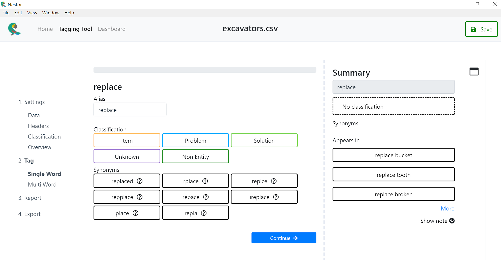
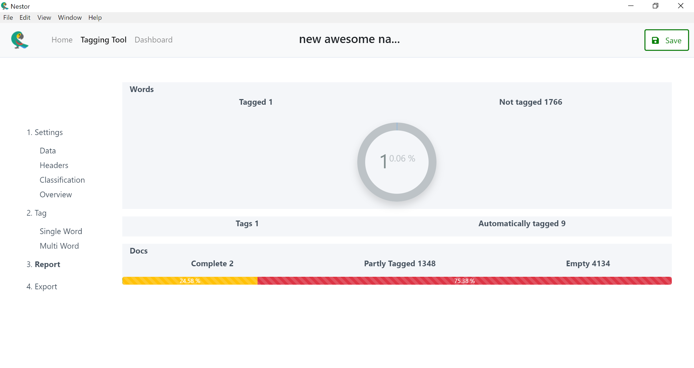

{width="4.5625in"
height="1.1979166666666667in"}

Nestor User Guide

Developed by

**Michael Brundage** : Principal Investigator

**Thurston Sexton** : Nestor Technical Lead

**Sakina Laanani** : Nestor developer (2018-2019)

**Cedric Bell** : Nestor developer (2019-2020)

**Summary**

**[Introduction](#introduction) 3**

**[1. Settings](#settings) 4**

> [1.1 Home](#home) 4
>
> [1.2 Manage projects](#manage-projects) 5
>
> [1.3 Upload a file](#upload-a-file) 6
>
> [1.4 Select columns](#select-columns) 7
>
> [1.5 Classification](#classification) 8
>
> [1.6 Overview](#overview) 9

**[2. Tagging tool](#tagging-tool) 10**

> [2.1 SingleTokens](#singletokens) 10
>
> [2.2 Multi Tokens](#multi-tokens) 13
>
> [2.3 Search tokens](#search-tokens) 14
>
> [2.4 Save a project](#save-a-project) 15

**[3. Report](#report) 17**

**[4. Export](#export) 18**

**[5. Other information](#other-information) 19**

Introduction
============

This user guide of the nestor application is addressed to all users who
are going to interact with the application in order to give
understanding to data sets that previously were too

unstructured or filled with jargon to analyze. This document\'s main
focus is to explain how to use the application.

The Nestor application provides you the ability to import data from a
csv file, and to tag the tokens which are the most representative ones,
to enable you to have a clearer overview of the data you gave us in
input. The goal of this application is to present with a more user
friendly design the same features than in another
[[version]{.underline}](https://nestor.readthedocs.io/en/latest/index.html)
previously released.

1. Settings
===========

1.1 Home 
--------

{width="6.5in"
height="3.4583333333333335in"}**figure 1 : Home page of Nestor (header
in red)**

When you open the application, you will see a quick loading screen and
then the figure 1 like above. During your use of the application, the
header will remain the same and you can navigate to the tagging tool and
the dashboard through that header. On this header, there is also a save
button which will remain disabled unless you start a new project. Still
in the header, you can also see the project's name you're currently
working on. If you click on the new project button, you will be
redirected to the upload page (figure 3). If you click on the manage
projects button you will be prompted figure 2.

 

1.2 Manage projects 
-------------------

{width="6.5in" height="3.4444444444444446in"}

**figure 2 : Manage project popup**

This popup is opened when you click on the Manage projects button in the
home page. On this popup, you can select one project from your projects
list and then either open or delete it. When you delete one project,
it's not going to be in your project list anymore. When you open a
project, you will be redirected to the Overview tab (figure 6) with all
the loaded settings and tagged tokens of your previous saving action. If
you don't have any projects yet, you will be prompted to first create
one in order to retrieve it in this modal later.

 

1.3 Upload a file 
-----------------

{width="6.5in" height="3.4583333333333335in"}

**figure 3 : Upload a new file**

In this page, you can click on the "select a file" green button which is
going to ask you to select a csv file from your laptop. When you upload
a new file successfully, you will see the name of the file you just
uploaded right below the green button. You can click on the start button
to go to the figure 4 below.

 

1.4 Select columns
------------------

{width="6.5in"
height="3.4583333333333335in"}**figure 4 : Select columns page**

In this tab, you have to select the columns you want to tag by clicking
on them. The columns are basically the headers of the csv file you
uploaded before. For now, users are strongly advised to select the
columns of natural language in it. The algorithms are not yet strong
enough to deal with only numbers or dates. Some improvements are under
development to better handle the numbers as tokens. By hovering your
mouse on the column\'s name, you will see tooltips to preview quickly
what is in each column. When you're done selecting the columns to tag,
you can click on Continue to see the figure 5.

1.5 Classification 
------------------

{width="6.5in" height="3.4583333333333335in"}
-----------------------------------------------------------------------

**Figure 5 : Classification explanation**

This page's role is to explain how you are supposed to tag the tokens
you will see after the settings section. Basically, all the tokens can
be regrouped into the concepts of item, solution, problem, unknown and
non entity. Moreover, two hybrid classifications are available for the
multiTokens : Object Fault which is basically a problem related to an
item and an object resolution, which is a solution related to an item.
You will see this explanations if you hover these elements
({width="0.20833333333333334in"
height="0.2160498687664042in"}). You can click on the continue button to
be redirected to the overview tab (figure 6).

1.6 Overview
------------

{width="6.5in"
height="3.111111111111111in"}{width="6.5in"
height="1.7638888888888888in"}

**Figure 6 : overview of your settings**

This page is making the summary of the settings chosen previously on
your navigation : the columns or headers, the classification. There is
also a duration section, whose goal is just to show you an estimated
time of tagging process for a given number of tokens. After clicking on
the continue button, you will now go to the tagging tool section.
(figure 7)

2. Tagging tool
===============

2.1 SingleTokens
----------------

{width="6.5in" height="3.388888888888889in"}

**figure 7 : single tokens page**

The tagging tool is separated into two parts : the tagging section and
the summary one. The summary gets updated automatically when you're
tagging the current token. On the tagging section, you have the field
alias that you can use to rename a token at your convenience. You can
also click on any classification you think suits the best with the
token. You can also select synonyms which are basically misspellings of
the token. You can preview a few sentences on where the synonyms
appeared to get the context of use of these potential synonyms by
hovering over the icon
{width="0.20833333333333334in"
height="0.24038495188101489in"} on every synonym.

In figure 8, you can see the synonyms selected by a user. The selected
synonyms can be deselected if
needed.{width="6.5in"
height="3.4722222222222223in"}

**Figure 8 : single tokens with synonyms selected**

In figure 9, an alert message has appeared because the user clicked on
continue before selecting a
classification.{width="6.5in"
height="3.4583333333333335in"}

**Figure 9 : single tokens with alert message**

On the figure 10, you can see that the progress bar updates its value
right after every click on the continue button. This progress bar shows
the capacity of knowledge that the algorithms have on the data.
Basically, if you have a percentage of completeness of 40%, it means
that on 40% of the rows of the original file you have tagged at least
one token. {width="6.5in"
height="3.4444444444444446in"}

**Figure 10 : progress bar updated**

On the summary section, you can see a series of 3 multi tokens in which
the single token you're currently tagging appeared in. This was made to
enable any user to navigate more easily from single to multi token. If
you click on the More button right below these three multi tokens, you
will be able to see a popup containing all the multi words that have the
single token you're working on.

2.2 Multi Tokens
----------------

{width="6.5in" height="3.4444444444444446in"}

**Figure 11 : multi tokenpage**

The multi token page is very similar to the single token one. Let's
explain the two differences between them. First, in this page, you will
be able to classify the multi words with the hybrid classifications
explained previously on the classification section. Secondly, in the
summary, the section composed by is the exact reverse of the "appears
in" section of the single token page. It is made to make it easier to
navigate back and forth between single tokens and multi tokens.

2.3 Search tokens
-----------------

{width="6.5in" height="3.4722222222222223in"}

**Figure 12 : search feature**

If you're looking for a specific token you can click on this icon
{width="0.20833333333333334in"
height="0.20833333333333334in"}, it will display then figure 12's popup.
This popup is basically composed by a search bar in which you can type
the token you're looking for or you can choose to classify them by
alphabetical order to see figure 13 and then select the first letter of
your token and then, your token.

{width="6.5in" height="3.4722222222222223in"}

**Figure 13 : search feature - alphabetical filter**

2.4 Save a project
------------------

{width="6.5in" height="3.4583333333333335in"}

**Figure 14 : saving action**

When you're done choosing the headers settings and that you imported
data, you are now able to save your project in a local database
instance. The data you imported in this project will only remain in your
laptop and will be stored in the AppData directory. On the figure 14,
you can change the name of the project you are working on, and then
click on save to add it to your list of projects presented in the home
page. Default name will be the name of the file you uploaded.

3. Report
=========

{width="6.5in" height="3.4583333333333335in"}

**Figure 15 : report page**

This page is currently a quick summary of the situation of the project
opened. In this example, the user tagged 1 word with 9 synonyms
selected, which are located in 24.58% of the lines of the original file.
There are still 1766 potential tokens to tag.

4. Export
=========

{width="6.5in" height="3.4583333333333335in"}

**Figure 16 : export page**

In this page, you are able to download some outputs of the application :

-   the output file : readable csv of the original data and the tokens
    > tagged.

-   The vocab file single words : list of the single tokens tagged
    > ranked by 'tf-idf' with their tag and their score.

-   The vocab file multi words : list of the multi word tokens tagged
    > ranked by 'tf-idf' with their tag and their score.

5. Other information
====================

The Nestor application doesn't need any network connection and any
softwares already installed. All that is needed for the application is
already in it.

In a decent laptop with regular performances, the application doesn't
have any lag.

The storage capacity limit is currently set to the client's laptop
capacity. If you don't have storage left in your laptop, then you might
have some troubles saving a project in Nestor.
